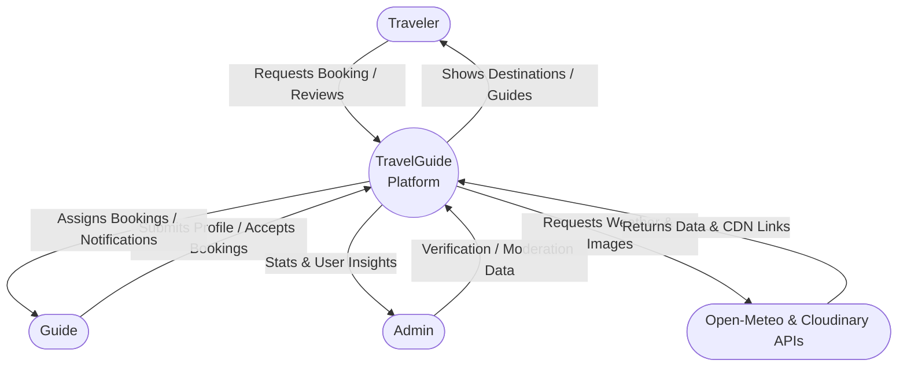
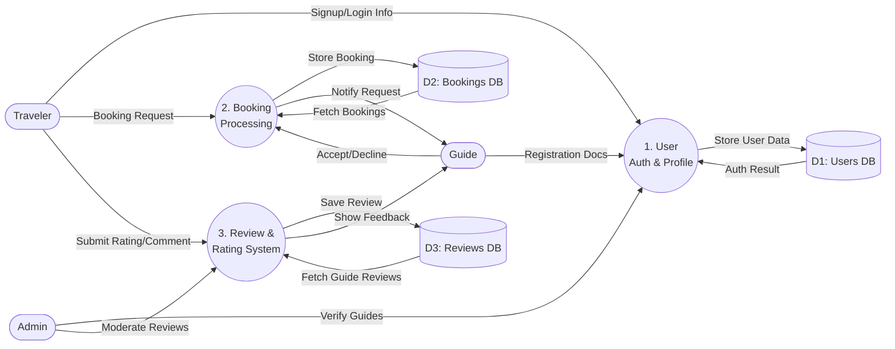
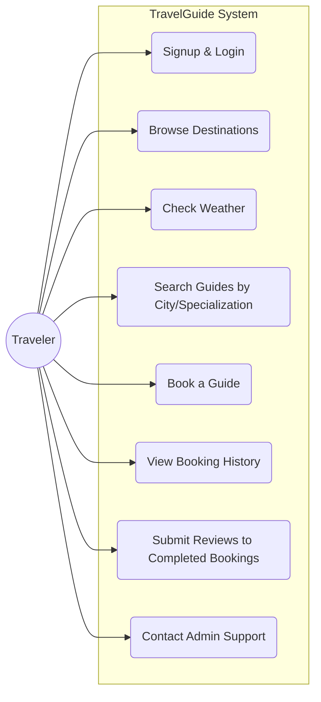
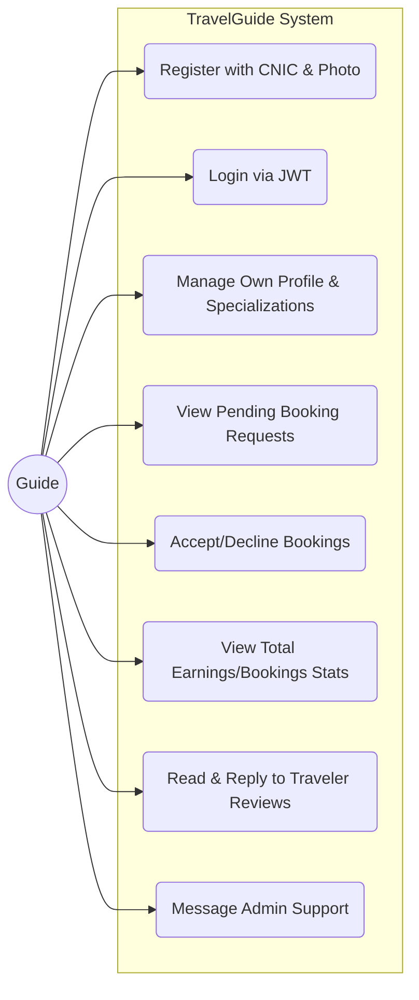
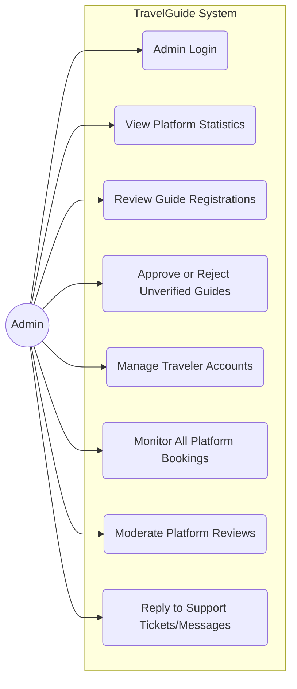

# Data Flow Diagrams (DFD) & Individual Use Cases

## 1. DFD Level 0 (Context Diagram)
This shows the entire system as a single process interacting with external entities (Traveler, Guide, Admin, and External APIs).

## 2. DFD Level 1 (Main Processes Diagram)
This breaks down the system into its primary processes (User Auth, Booking Processing, Review System) and shows how data flows into the Databases.

---

## 3. Traveler Use Case Diagram
This isolates the functionalities specifically available to the Traveler.

## 4. Guide Use Case Diagram
This focuses strictly on what the Guide can accomplish in the system.

## 5. Admin Use Case Diagram
This demonstrates the administrative capabilities and moderation tools.

