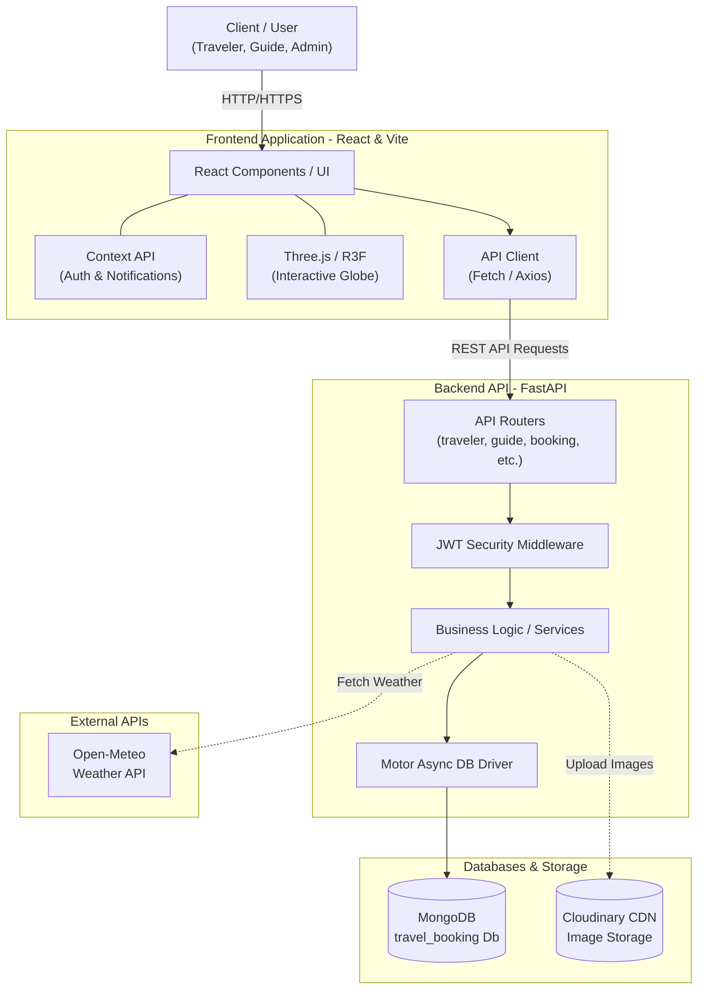
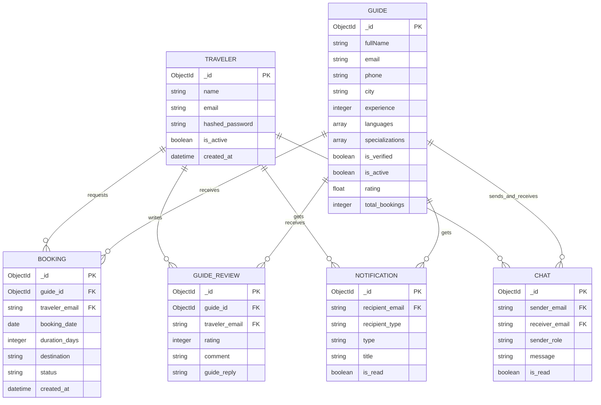
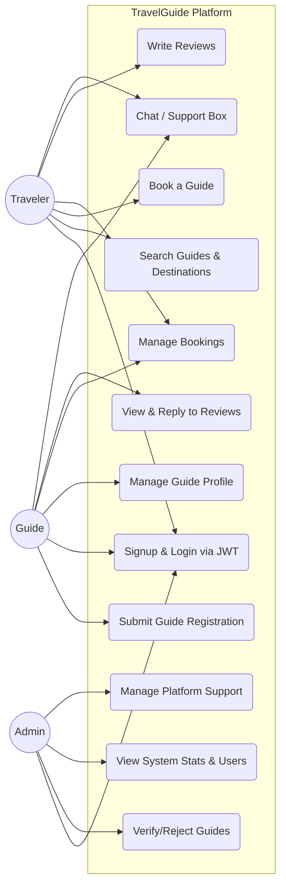
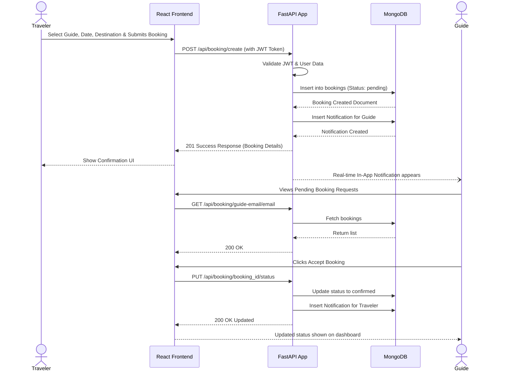
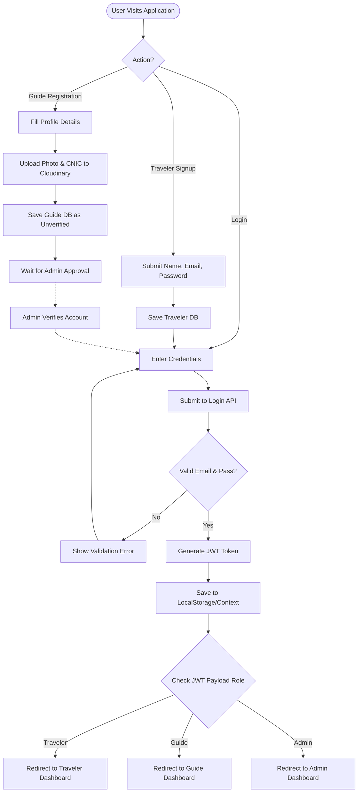

# TravelGuide Pakistan - System Diagrams

Here are the standard UML and System Design diagrams for your FYP report based on the TravelGuide Pakistan system architecture. These use standard Mermaid.js syntax.

## 1. System Architecture Diagram
This diagram shows how different components of your stack (Frontend, Backend, Database, and 3rd party APIs) communicate with each other.

---

## 2. Entity Relationship Diagram (ERD)
This represents the underlying MongoDB NoSQL schema of your application and references between collections.

---

## 3. Use Case Diagram
This identifies the actors and the specific functionalities they have access to within the system.

---

## 4. Sequence Diagram: Booking Process
This illustrates the step-by-step process of how a Traveler books a verified Guide.

---

## 5. Activity Diagram / User Authentication Flow
This captures the primary flow and decision points when users enter the application.

